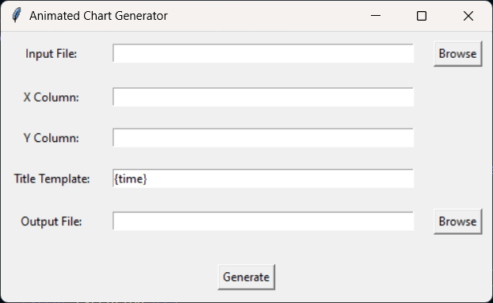
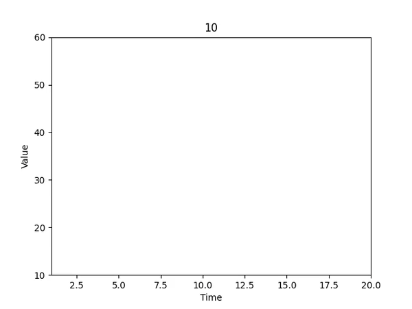

# 📊 Animated Chart Video Generator

Create aninmated graphs and charts from Excel files and CSVs! 

## Features

- 📈 **Supports CSV and Excel Files**: Load data from both CSV and Excel files.
- 🎥 **Generate Animated Chart Videos**: Create smooth animations of your data over time.
- 🖼️ **Customizable Titles**: Add dynamic titles to your animations.
- 💻 **Easy-to-Use GUI**: Intuitive graphical user interface for seamless operation.

## Installation

1. **Clone the repository**:
   ```bash
   git clone https://github.com/yourusername/animated-chart-video-generator.git
   cd animated-chart-video-generator
   ```

2. **Install dependencies**:
   ```bash
   pip install -r requirements.txt
   ```

3. **Ensure `ffmpeg` is installed and in your PATH**:
   - Download `ffmpeg` from [FFmpeg Download Page](https://ffmpeg.org/download.html)
   - Extract and add the `bin` folder to your PATH

## Usage

### Using the GUI

1. **Run the GUI**:
   ```bash
   python gui.py
   ```

2. **Use the interface**:
   - Browse and select your input file (CSV or Excel).
   - Enter the column names for the X and Y axes.
   - Customize your title template (e.g., `{time} - Value: {value}`).
   - Browse and select the output file path.
   - Click the "Generate" button to create your animated chart video!

### Example

```python
from graph_gen import generate_video_from_data

# Generate video from data
generate_video_from_data(
    'path/to/data.csv',  # Input file
    'Time',              # X column
    'Value',             # Y column
    'output.mp4',        # Output file
    '{time} - Value: {value}'  # Title template
)
```

## Screenshots




## License

This project is licensed under the MIT License - see the [LICENSE](LICENSE) file for details.
